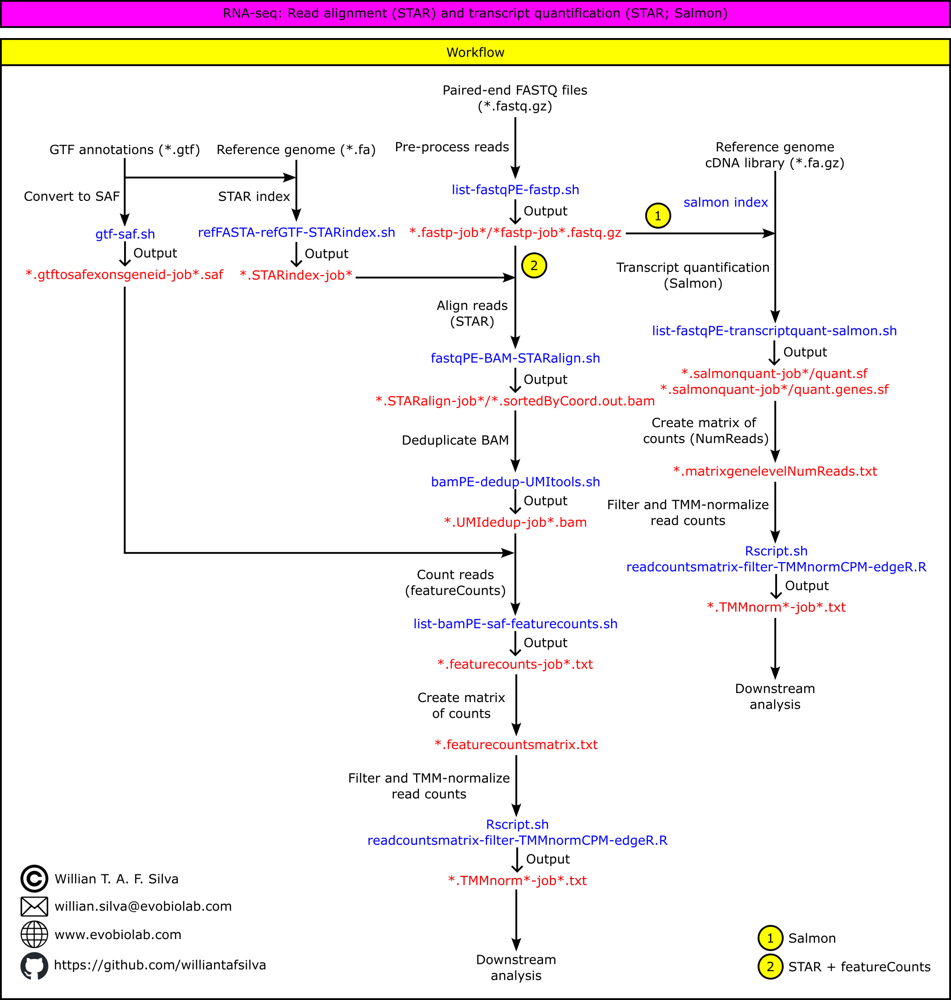
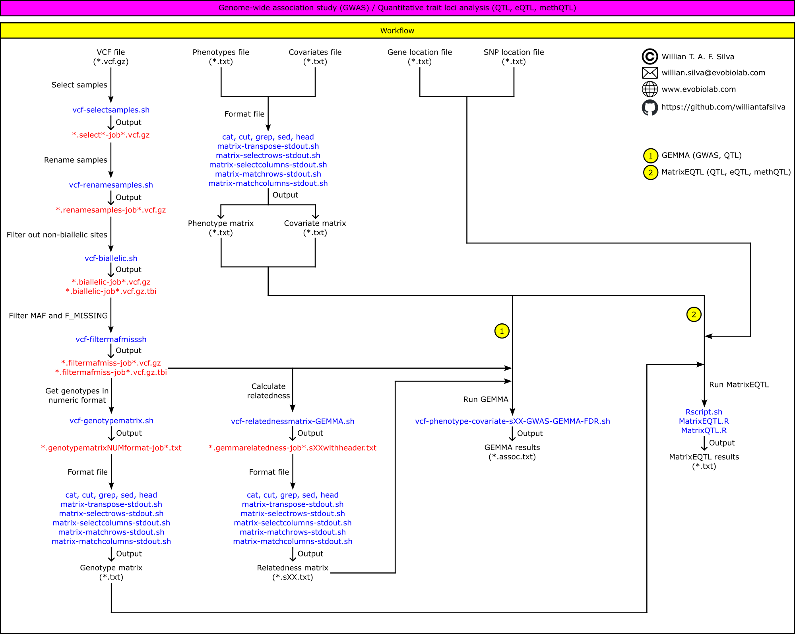
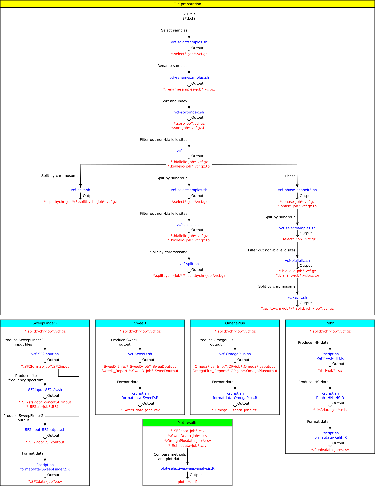

# Bioinformatics workflow

## Workflow: RNA-seq read mapping and transcript quantification

## Workflow: Genome-wide association study (GWAS) / Quantitative trait loci analysis (QTL, eQTL, methQTL)

## Workflow: Selective sweeps (SweepFinder2, SweeD, OmegaPlus, Rehh)

